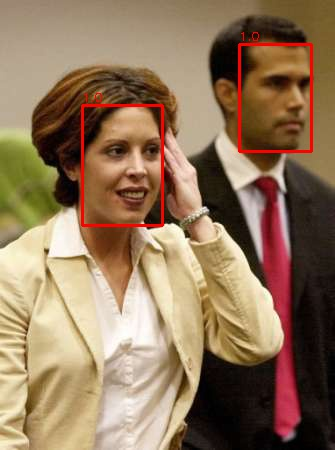
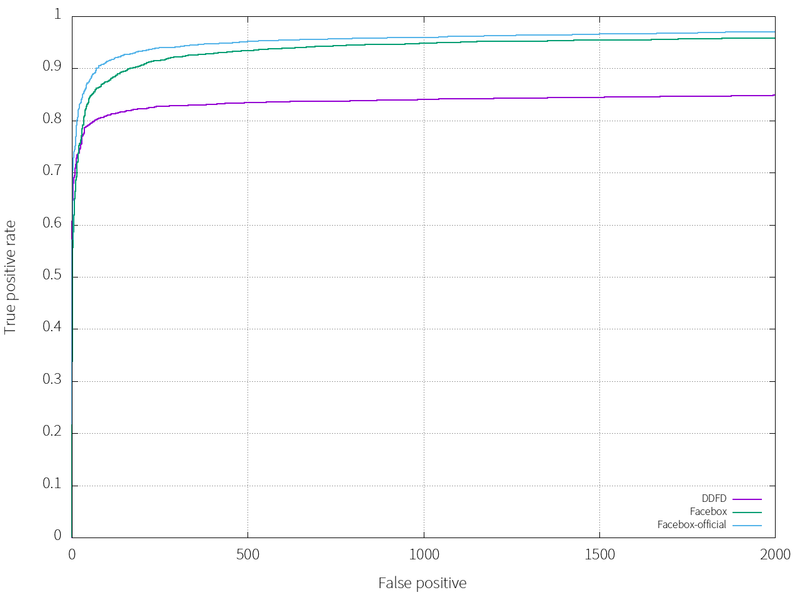

# Faceboxes
[faceBoxes: a cpu real-time face detector with hight accuracy](https://arxiv.org/abs/1708.05234)  

Faceboxes is a SSD style object detector, it is designed for fast face detect, has a lightweight yet powerful network structure.

## update

<!-- I forked from [lxg2015](https://github.com/lxg2015), we did it together before, now i want to update something -->

1. Better network, our convolution module should be con_bn_relu like, not just conv.

2. Double batch size, it used ~7G memory during train

3. Add use_gpu Flag in predict, add detect_gpu function

Performance is better than before!

Efficiency is not good as official, 60FPS on 1080ti, much slower on CPU, it maybe slow in decoder.

## usage
visdom  
pytorch 0.2   
torchvision  

our data annotation
```
data/all/image01468.jpg 1 119 185 139 139 1
data/all/image01449.jpg 2 9 39 74 74 1 409 93 77 77 1
```
format：
```
path/image_name.jpg num_face x y w h 1 x y w h 1
```

## Result



## Fddb
和原论文的结果有些差距，主要问题可能是出现在数据增强部分。

tips：这里的另一条曲线DDFD(Multi-view Face Detection Using Deep Convolutional Neural Networks)只是拿来做个参考  

 
