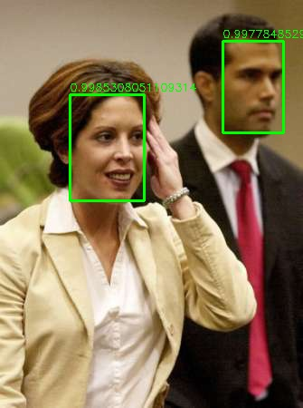
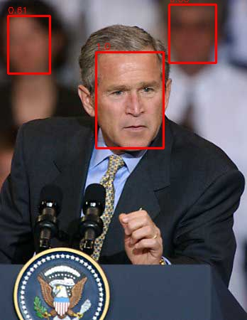
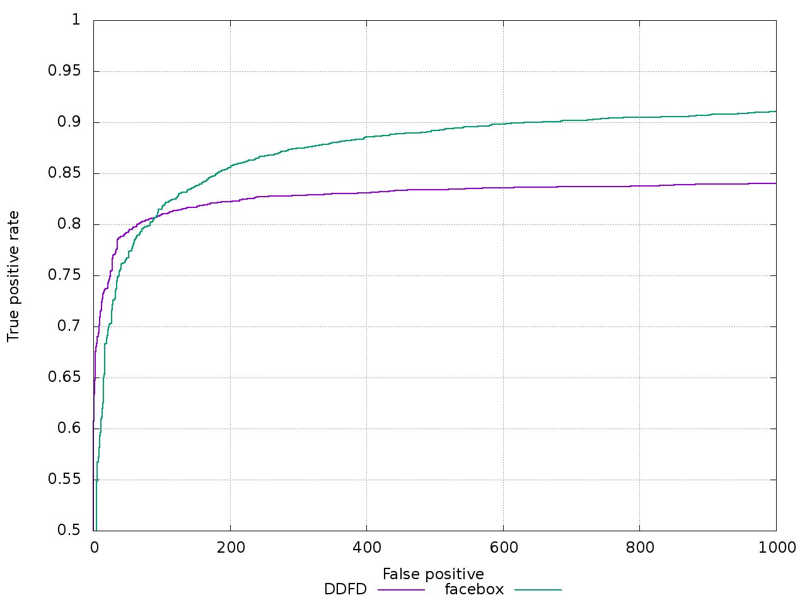

# Faceboxes
[faceBoxes: a cpu real-time face detector with hight accuracy](https://arxiv.org/abs/1708.05234)  
使用pytorch粗略的实现Faceboxes。

## usage
visdom  
pytorch 0.2   
torchvision  

这里是训练和测试代码，Fddb的评测曲线是按照Fddb官网的说明操作的，没有在这个里面。代码写得比较乱，不过主要能保证数据集读取正确就可以正常训练了。 数据集的描述文件是：
```
data/all/image01468.jpg 1 119 185 139 139 1
data/all/image01449.jpg 2 9 39 74 74 1 409 93 77 77 1
```
也就是这种格式：
```
path/image_name.jpg num x y w h 1 x y w h 1 这样就是说一张图片中有num个人脸
```

## Result



## Loss
在widerFace数据集上训练的训练集loss。  


## Fddb
和原论文的结果有些差距，主要问题应该是出现在数据增强部分。  

  

tips：在FDDB数据集上没有发现FaceBoxes作者的数据，这里的另一条曲线DDFD(Multi-view Face Detection Using Deep Convolutional Neural Networks)只是拿来做个参考 
